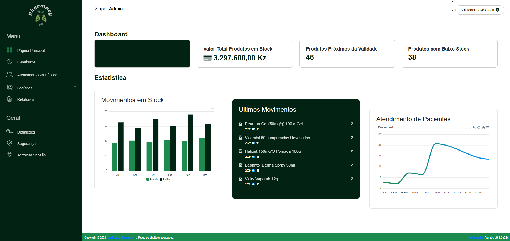

PharmaSys
<!-- Improved compatibility of back to top link: See: https://github.com/othneildrew/Best-README-Template/pull/73 -->
<a name="readme-top"></a>

<!-- PROJECT SHIELDS -->


<!-- PROJECT LOGO --> 
<br /> <div align="center"> <a href="https://github.com/greciodiogo/PharmaSys">  </a> <h3 align="center">PharmaSys</h3> <p align="center"> Sistema de gestão de farmácias para simplificar e organizar as operações farmacêuticas. <br /> <a href="https://github.com/greciodiogo/PharmaSys"><strong>Explore a documentação »</strong></a> <br /> <br /> <a href="https://github.com/greciodiogo/PharmaSys">Ver Demonstração</a> · <a href="https://github.com/greciodiogo/PharmaSys/issues">Reportar Problema</a> · <a href="https://github.com/greciodiogo/PharmaSys/issues">Solicitar Funcionalidade</a> </p> </div>

### Sobre o Projeto



O **PharmaSys** é um sistema de gestão de farmácias projetado para simplificar e organizar as operações farmacêuticas. Ele ajuda na gestão de estoque, acompanhamento de pacientes e integração com fornecedores.


<p align="right">(<a href="#readme-top">voltar ao topo</a>)</p>

### Construído com:

* [![Angular][Angular.io]][Angular-url] [![Typescript][Typescript.com]][Typescript-url] [![Js][Js.com]][Js-url] [![JQuery][JQuery.com]][JQuery-url]
* [![HTML][HTML.com]][HTML-url] [![Css][Css.com]][Css-url] [![Saas][Saas.com]][Saas-url] [![Bootstrap][Bootstrap.com]][Bootstrap-url]

<p align="right">(<a href="#readme-top">voltar ao topo</a>)</p>

### Início Rápido
Estas instruções ajudam a configurar o projeto localmente para desenvolvimento ou testes.

### Pré-requisitos
Certifique-se de que tem o Node.js e o npm instalados:

```sh
npm install npm@latest -g
```
### Instalação
Clone o repositório:
```sh
Copiar código
git clone https://github.com/greciodiogo/PharmaSys.git
```
Acesse o diretório do projeto:
```sh
cd PharmaSys
```

Instale as dependências do Angular:
```sh
npm install
```
Inicie o servidor de desenvolvimento:
```sh
ng serve
```
Acesse o projeto no navegador em http://localhost:4200.
<p align="right">(<a href="#readme-top">voltar ao topo</a>)</p>

### Uso
Com o PharmaSys, você pode:

Monitorar o estoque de medicamentos e prever necessidades de reposição.
Cadastrar novos fornecedores e gerenciar contratos.
Controlar armazéns e distribuir produtos eficientemente.
Acompanhar pacientes e serviços prestados na farmácia.
<p align="right">(<a href="#readme-top">voltar ao topo</a>)</p>

### Roadmap de Desenvolvimento
 Implementar telas de cadastro de medicamentos.
 Adicionar funcionalidade de relatórios de estoque.
 Criar integração com API de fornecedores.
 Implementar módulo de gestão de pacientes.
Veja todas as funcionalidades planejadas e problemas conhecidos em Issues.

<p align="right">(<a href="#readme-top">voltar ao topo</a>)</p>

### Contribuindo
Contribuições são bem-vindas! Siga os passos abaixo para contribuir:

1. Faça um fork do projeto.
2. Crie um branch para sua funcionalidade (git checkout -b feature/NovaFuncionalidade).
3. Faça as alterações e realize commit (git commit -m 'Descrição da nova funcionalidade').
4. Envie para o branch remoto (git push origin feature/NovaFuncionalidade).
5. Abra um pull request.


Contributions are what make the open source community such an amazing place to learn, inspire, and create. Any contributions you make are **greatly appreciated**.

If you have a suggestion that would make this better, please fork the repo and create a pull request. You can also simply open an issue with the tag "enhancement".
Don't forget to give the project a star! Thanks again!

1. Fork the Project
2. Create your Feature Branch (`git checkout -b feature/AmazingFeature`)
3. Commit your Changes (`git commit -m 'Add some AmazingFeature'`)
4. Push to the Branch (`git push origin feature/AmazingFeature`)
5. Open a Pull Request

<p align="right">(<a href="#readme-top">voltar ao topo</a>)</p>
Licença
Distribuído sob a Licença MIT. Veja LICENSE.txt para mais informações.

<p align="right">(<a href="#readme-top">voltar ao topo</a>)</p>
Contato
Grécio Diogo

Email: fonebahia8@gmail.com
LinkedIn: greciodiogo8
GitHub: greciodiogo
<p align="right">(<a href="#readme-top">voltar ao topo</a>)</p>

<!-- MARKDOWN LINKS & IMAGES -->
<!-- https://www.markdownguide.org/basic-syntax/#reference-style-links -->
[contributors-shield]: https://img.shields.io/github/contributors/github_username/repo_name.svg?style=for-the-badge
[contributors-url]: https://github.com/github_username/repo_name/graphs/contributors
[forks-shield]: https://img.shields.io/github/forks/github_username/repo_name.svg?style=for-the-badge
[forks-url]: https://github.com/github_username/repo_name/network/members
[stars-shield]: https://img.shields.io/github/stars/github_username/repo_name.svg?style=for-the-badge
[stars-url]: https://github.com/github_username/repo_name/stargazers
[issues-shield]: https://img.shields.io/github/issues/github_username/repo_name.svg?style=for-the-badge
[issues-url]: https://github.com/github_username/repo_name/issues
[license-shield]: https://img.shields.io/github/license/github_username/repo_name.svg?style=for-the-badge
[license-url]: https://github.com/github_username/repo_name/blob/master/LICENSE.txt
[linkedin-shield]: https://img.shields.io/badge/-LinkedIn-black.svg?style=for-the-badge&logo=linkedin&colorB=555
[linkedin-url]: https://linkedin.com/in/linkedin_username
[product-screenshot]: images/screenshot.png
[React.js]: https://img.shields.io/badge/React-20232A?style=for-the-badge&logo=react&logoColor=61DAFB
[React-url]: https://reactjs.org/
[Vue.js]: https://img.shields.io/badge/Vue.js-35495E?style=for-the-badge&logo=vuedotjs&logoColor=4FC08D
[Vue-url]: https://vuejs.org/
[Angular.io]: https://img.shields.io/badge/Angular-DD0031?style=for-the-badge&logo=angular&logoColor=white
[Angular-url]: https://angular.io/
[Bootstrap.com]: https://img.shields.io/badge/Bootstrap-563D7C?style=for-the-badge&logo=bootstrap&logoColor=white
[Bootstrap-url]: https://getbootstrap.com
[JQuery.com]: https://img.shields.io/badge/jQuery-0769AD?style=for-the-badge&logo=jquery&logoColor=white
[JQuery-url]: https://jquery.com 
[Typescript.com]: https://img.shields.io/badge/TypeScript-007ACC?style=for-the-badge&logo=typescript&logoColor=white
[Typescript-url]: https://www.typescriptlang.org/
[HTML-url]: https://www.w3schools.com/html/
[HTML.com]: https://img.shields.io/badge/HTML5-E34F26?style=for-the-badge&logo=html5&logoColor=white
[Saas-url]: https://sass-lang.com/
[Saas.com]: https://img.shields.io/badge/Sass-CC6699?style=for-the-badge&logo=sass&logoColor=white
[Css-url]: https://www.w3schools.com/css/
[Css.com]: https://img.shields.io/badge/CSS-239120?&style=for-the-badge&logo=css3&logoColor=white
[Js-url]: https://www.w3schools.com/js/
[Js.com]: https://img.shields.io/badge/JavaScript-F7DF1E?style=for-the-badge&logo=javascript&logoColor=black